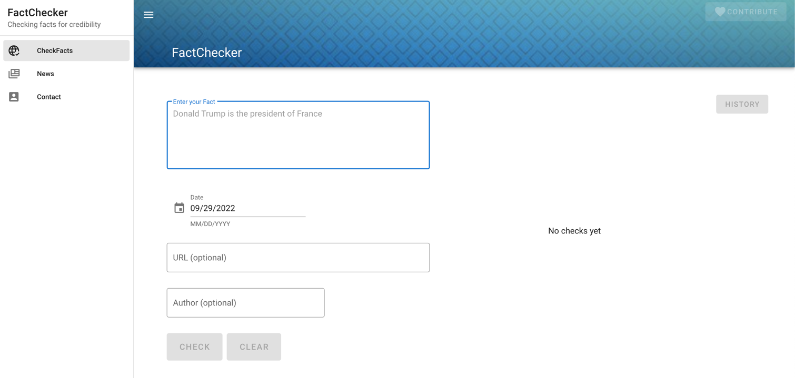
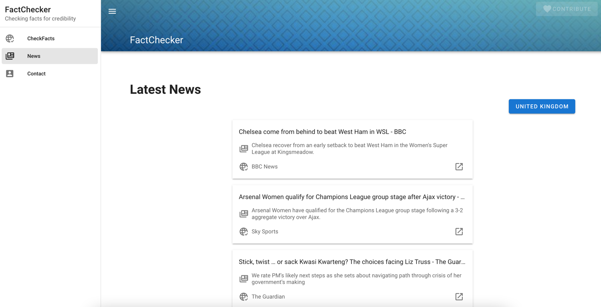

# FactChecker Frontend

Welcome to our FakeChecker frontend repository.
It is a simple user interface with some neat features to give you a nice fact checking experience.
Simply follow the steps underneath and don't forgot to check in with our backend repository
[backend repo](https://github.com/kevinkrs/masterproject_backend)

## Project setup

It is pretty straight forward

1. First run ``` npm install ``` to install all required packages

2. Start server with ```npm run serve```

## Frontend API documentation

- [FactChecker](website/components/FactChecker.md)
- [InferenceDashboard](website/components/InferenceDashboard.md)
- [NewsTicker](website/components/NewsTicker.md)
- [MenuHeader](website/components/MenuHeader.md)
- [PlotlyChart](website/components/PlotlyChart.md)

## UI



